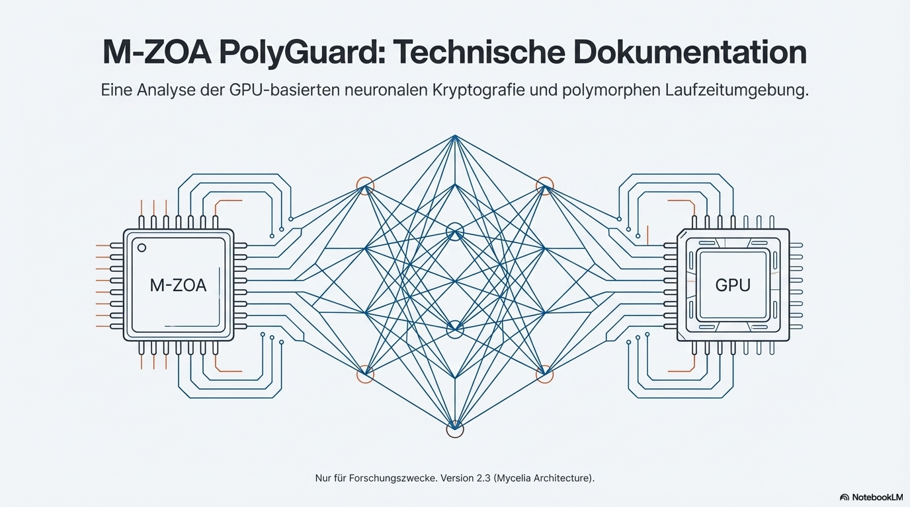
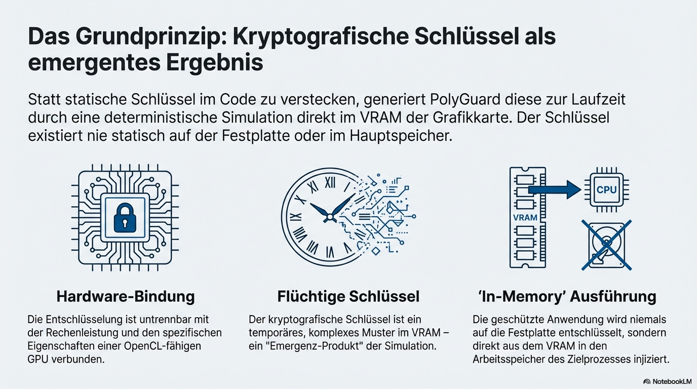
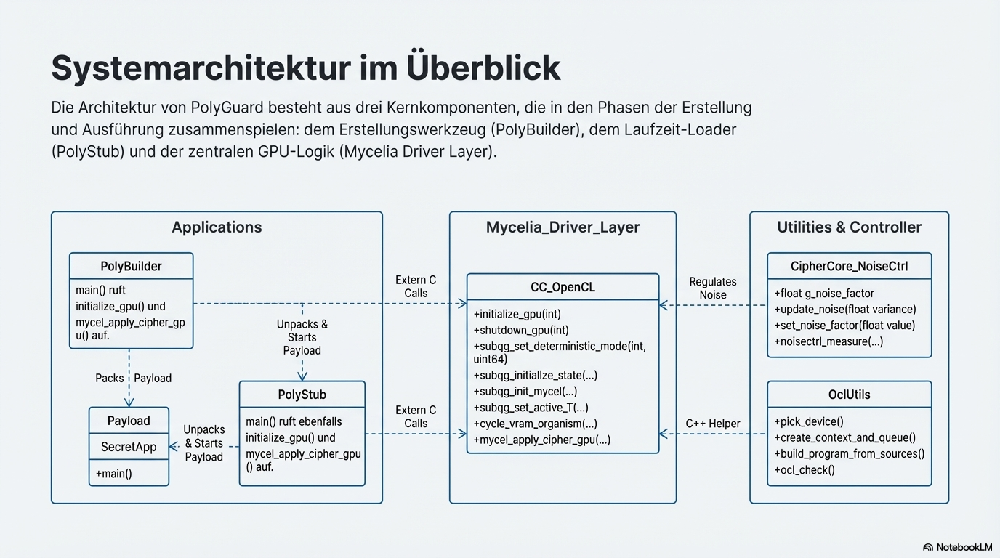
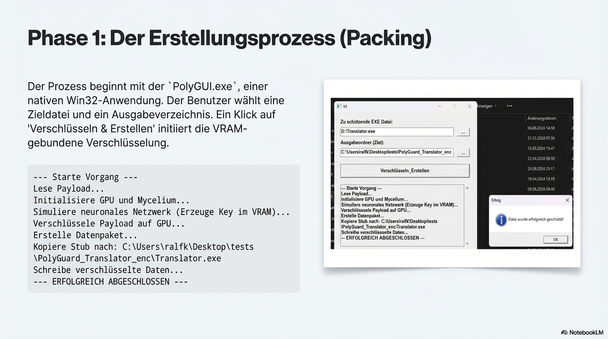
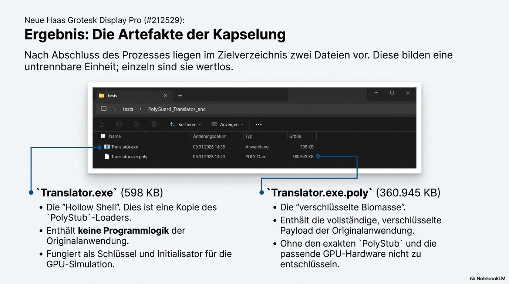
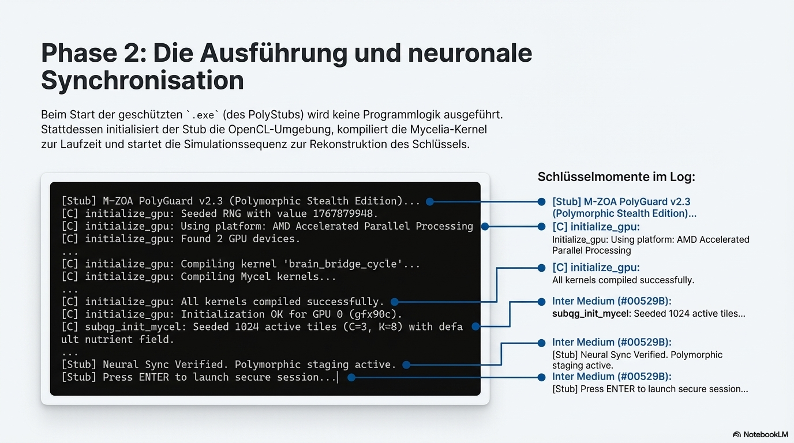
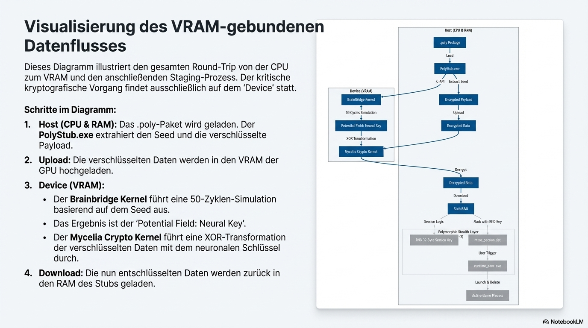
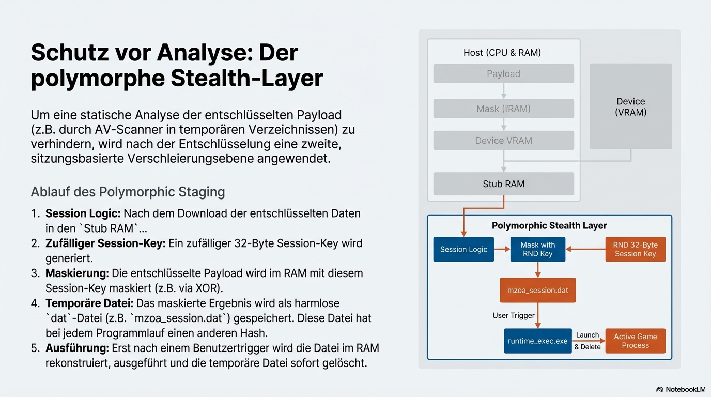
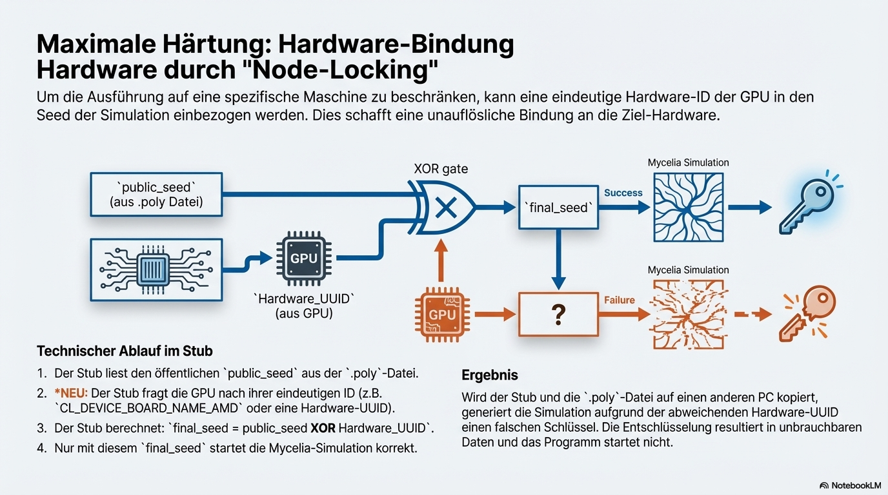
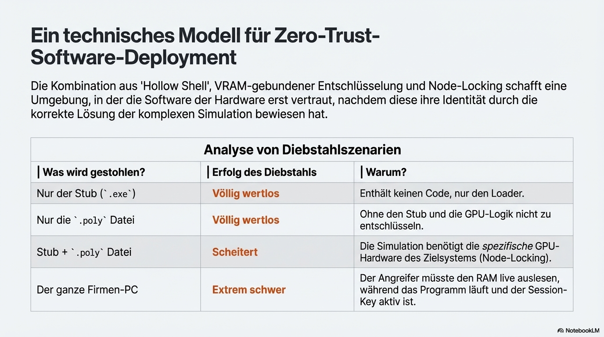

# M-ZOA PolyGuard (PolyPacker)
## M-ZOA
Mycelia – Zonal Orchestrated Architecture

Bezeichnung für eine verteilte, biologisch inspirierte Systemarchitektur,
bestehend aus klar abgegrenzten Zonen, die durch einen Orchestrationslayer
koordiniert werden. Grundlage des PolyGuard / PolyPacker / Mycelia-Stacks.

**GPU-basierte neuronale Kryptografie & Polymorpher Packer**

M-ZOA PolyGuard ist ein experimenteller EXE-Packer, der OpenCL nutzt, um kryptografische Schlüssel dynamisch im VRAM der Grafikkarte zu generieren. Anstatt Schlüssel im Code zu verstecken, werden diese durch eine deterministische Simulation eines neuronalen Mycel-Netzwerks (SubQG) zur Laufzeit erzeugt.

Die Payload wird dabei nie auf die Festplatte entschlüsselt, sondern direkt aus dem VRAM in den Arbeitsspeicher injiziert (Memory Execution / RunPE).
> **📄 [Download Enterprise Whitepaper (PDF)](docs/M-ZOA_PolyGuard_Enterprise_Whitepaper.pdf)** - Detaillierte technische Analyse und Integrationsszenarien für Distributionsplattformen.


## 🚀 Features

*   **Native Windows GUI:** Keine externen Frameworks (Qt/ImGui) notwendig, reine Win32 API für maximale Kompatibilität und minimale Größe.
*   **Hardware-Bindung:** Die Entschlüsselung erfordert eine OpenCL-fähige GPU. Der Schlüssel existiert nur flüchtig im VRAM.
*   **Chunked Processing:** Unterstützung für große Dateien (z.B. Spiele > 500 MB) durch intelligente Speicherverwaltung und Streaming-Decryption.
*   **Neural Key Generation:** Deterministisches Chaos im GPU-Speicher dient als Schlüssel (Seed-basiert).
*   **Stealth Execution:** Die geschützte Anwendung wird direkt im Speicher ausgeführt (`PolyStub` -> RAM).

## 🛠 Voraussetzungen

Um das Projekt zu kompilieren, benötigst du folgende Umgebung:

*   **Betriebssystem:** Windows 10 / 11 (x64)
*   **Compiler:** Visual Studio 2022 (MSVC C++20)
*   **Build-System:** CMake (mind. 3.20)
*   **Paketmanager:** vcpkg
*   **Hardware:** Eine Grafikkarte mit OpenCL 1.2+ Unterstützung (NVIDIA, AMD, Intel).


## 💻 Systemanforderungen (Laufzeit)

Um den **PolyPacker (GUI)** auf einem anderen PC auszuführen oder **geschützte Anwendungen** zu starten, sind keine Installationen von Visual Studio oder CMake notwendig. Es werden lediglich folgende Komponenten benötigt:

### 1. Notwendige Dateien
Damit der Packer funktioniert, müssen diese beiden Dateien zwingend im **selben Verzeichnis** liegen:
*   `PolyGUI.exe` (Das Programm)
*   `PolyStub.exe` (Die Template-Datei, wird von der GUI benötigt)

### 2. Software-Abhängigkeiten
Der Ziel-Computer benötigt die Standard-Bibliotheken für C++ Anwendungen:
*   **Microsoft Visual C++ Redistributable 2015-2022 (x64)**
    *   *Fehlerbild bei Fehlen:* "msvcp140.dll / vcruntime140.dll wurde nicht gefunden."
    *   [Download bei Microsoft](https://aka.ms/vs/17/release/vc_redist.x64.exe)

### 3. Hardware & Treiber
Da die Verschlüsselung auf der GPU basiert:
*   **Grafikkarte:** NVIDIA, AMD oder Intel GPU.
*   **Treiber:** Aktuelle Grafikkartentreiber müssen installiert sein (diese enthalten die `OpenCL.dll`).
## 📦 Kompilierung

Das Projekt wird über PowerShell und CMake unter Verwendung der `vcpkg` Toolchain gebaut.

Führe die folgenden Befehle im **Hauptverzeichnis** des Projekts aus:

```powershell
# Pfad zu CMake (anpassen falls nötig)
$CMake = "C:\Program Files\CMake\bin\cmake.exe"

# 1. Projekt konfigurieren und Build-Dateien erstellen
# Hinweis: Passe den Pfad zu vcpkg.cmake an deine Installation an!
& $CMake -S . -B build -G "Visual Studio 17 2022" -A x64 -DCMAKE_TOOLCHAIN_FILE="D:/M-ZOA-GPU/vcpkg/scripts/buildsystems/vcpkg.cmake"

# 2. Kompilieren im Release-Modus
& $CMake --build build --config Release -j
```

Nach erfolgreichem Build findest du die Executables im Ordner `build/Dist/Release/`:
*   `PolyGUI.exe` (Das Packer-Tool)
*   `PolyStub.exe` (Die Vorlage für geschützte Dateien)
*   `SecretApp.exe` (Dummy-Anwendung zum Testen)
# M-ZOA PolyGuard (Technical Showcase)

**Experimentelle GPU-basierte neuronale Kryptografie & Polymorpher Packer**

> **⚠️ Hinweis:** Dieses Repository dient als technische Dokumentation und Showcase für die M-ZOA Mycelia Engine (Version 2.3). Der Quellcode ist proprietär ("Closed Source"), da die zugrundeliegende Simulationstechnologie (Mycelia Driver) geistiges Eigentum darstellt.

## 📄 Einleitung

**M-ZOA PolyGuard** demonstriert einen neuartigen Ansatz im Bereich Software-Schutz und Obfuskation. Anstatt kryptografische Schlüssel statisch im Code oder auf der Festplatte zu verstecken, generiert dieses System die Schlüssel **zur Laufzeit dynamisch im VRAM der Grafikkarte**.

Dies geschieht durch eine deterministische Simulation eines neuronalen Netzwerks ("Mycelia"), das auf Chaostheorie und Fluid-Dynamik basiert. Die geschützte Anwendung wird dabei niemals auf den Datenträger entschlüsselt, sondern direkt aus dem Grafikkartenspeicher in den Arbeitsspeicher injiziert (**Hardware-bound In-Memory Execution**).

---

## 🔍 Technische Dokumentation

### 1. Übersicht & Philosophie
Der Ansatz verbindet High-Performance-Computing (OpenCL) mit IT-Sicherheit. Der Schlüssel ist kein statischer Wert, sondern ein *Zustand*, der erst berechnet werden muss.




### 2. Systemarchitektur
Das System besteht aus dem Builder (GUI), dem Stub (Loader) und dem Herzstück: dem Mycelia-Treiber (`CC_OpenCL`), der die GPU steuert.



### 3. Der Workflow (Packing)
Die Erstellung erfolgt über eine native Win32-Anwendung, die große Dateien (Game-Assets, Anwendungen) mittels Chunking verarbeitet, um VRAM-Limits zu umgehen.




### 4. Die Ausführung (Runtime)
Der Startvorgang ist der kritischste Moment. Hier synchronisiert sich der CPU-Code mit der GPU-Logik. Nur wenn die Simulation exakt reproduziert wird, entsteht der korrekte Schlüssel.



### 5. Deep Dive: Die Mycelia Engine
Der Kern der Technologie. Hier werden mathematische Modelle (Izhikevich-Neuronen, SubQG-Felder) missbraucht, um kryptografische Entropie zu erzeugen.




### 6. Polymorphie & Stealth
Um statische Analyse und Emulatoren zu täuschen, nutzt das System "Session Keys" und temporäre Transformationen im RAM.



### 7. Hardware-Bindung (Node Locking)
Ein optionales Feature, das die Ausführung an eine spezifische Grafikkarte bindet. Der Seed wird mit der Hardware-ID der GPU verknüpft. Ein Kopieren der Dateien auf einen anderen PC macht sie unbrauchbar.




### 8. Empirische Ergebnisse
Der Beweis der Wirksamkeit gegen statische Signaturerkennung (Stand der Forschung).


---
## 📖 Benutzung

### 1. Dateien schützen (Builder)

Starten Sie `PolyGUI.exe`. Das Tool benötigt `PolyStub.exe` im selben Verzeichnis.


1.  Wählen Sie unter **"Zu schützende EXE Datei"** ihr Zielprogramm aus (z.B. `Translator.exe` oder `Game.exe`).
2.  Wählen Sie einen **Ausgabeordner**, in dem die geschützte Version gespeichert werden soll.
3.  Klicken Sie auf **"Verschlüsseln & Erstellen"**.


Das Tool führt nun eine Simulation auf Ihrer GPU durch, generiert den Schlüssel, verschlüsselt die Datei und erstellt im Zielordner die geschützte `.exe` sowie die dazugehörige `.poly` Datendatei.


### 2. Ausführen der geschützten Anwendung

Im Zielordner finden Sie nun (am Beispiel `Translator.exe`):
*   `Translator.exe` (Dies ist der umbenannte PolyStub)
*   `Translator.exe.poly` (Die verschlüsselten Daten)

Starten Sie einfach die `.exe`. Es öffnet sich kurz eine Konsole (der Stub), welche die GPU initialisiert, die neuronale Synchronisation durchführt und anschließend das eigentliche Programm startet.


### 3. Erfolgskontrolle

Wenn der Stub erfolgreich war ("Neural Sync Verified"), startet Ihre ursprüngliche Anwendung.


## 🧠 Technische Details

### Die Mycelia-Engine
Der Kern des Schutzes ist die Datei `src/CC_OpenCL.c`. Sie implementiert eine zelluläre Automatensimulation auf der GPU.
*   **Seed:** Ein 64-Bit Seed wird im Header der `.poly` Datei gespeichert.
*   **Simulation:** Der Stub startet die GPU-Kernel mit diesem Seed. Durch tausende parallele Rechenoperationen (Diffusion, Decay, Reaktion) entsteht im VRAM ein komplexes Muster.
*   **Key-Ableitung:** Der Zustand des VRAMs nach der Simulation *ist* der Schlüssel. Er wird nie in den RAM des Hauptprozessors kopiert.

### Chunking (Speichermanagement)
Um VRAM-Limits bei großen Dateien zu umgehen, nutzt `PolyGUI` und `PolyStub` ein Chunking-System:
1.  Die Datei wird in 64 MB Blöcke geteilt.
2.  Jeder Block wird einzeln in den VRAM geladen.
3.  Der GPU-Kernel entschlüsselt den Block basierend auf seiner Position im "virtuellen" Gesamtschlüssel (Offset).
4.  Der entschlüsselte Block wird sofort verarbeitet (gespeichert oder ausgeführt).

### Memory Injection
Der Stub speichert die entschlüsselte EXE niemals auf der Festplatte. Stattdessen wird sie mittels Process Hollowing / RunPE Techniken direkt in den virtuellen Speicher eines neuen Prozesses geschrieben und dort ausgeführt.

## 📂 Projektstruktur

*   `src/PolyGUI.cpp`: Hauptlogik der grafischen Oberfläche, Worker-Threads und Datei-Handling.
*   `src/PolyStub.cpp`: Der Laufzeit-Loader. Enthält die Logik zur Wiederherstellung und Injektion.
*   `src/PolyBuilder.cpp`: (Legacy) Konsolenversion des Packers.
*   `src/CC_OpenCL.c`: Der "Treiber". Enthält den gesamten OpenCL-Code und die Mycelia-Logik.
*   `src/ocl_utils.cpp`: Hilfsfunktionen für OpenCL-Initialisierung.

## ⚠️ Disclaimer

Dieses Tool dient ausschließlich zu Bildungszwecken und zur Demonstration von GPU-basierter Obfuskation. Die Verwendung zum Packen von Schadsoftware ist strengstens untersagt.

---
*Entwickelt als M-ZOA Research Project.*
